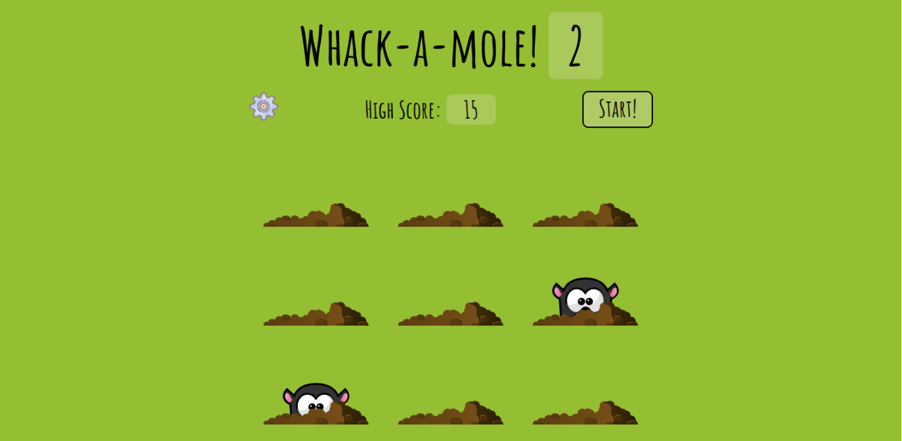
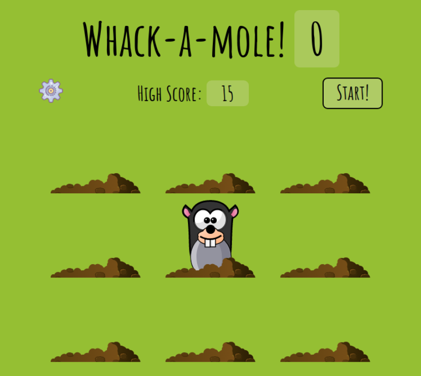
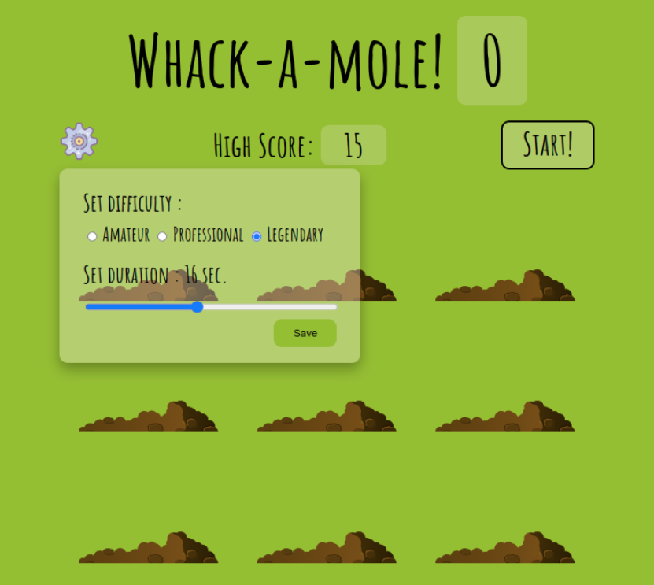

# Whack_A_Mole

[](LICENSE)


Classic whack-a-mole game in JavaScript.



 &nbsp;&nbsp; 

## Getting Started

Clone the repo or download as zip.
Start ```main.html``` on any server (e.g. localhost).

## Built with

Vanilla JavaScript, Html, and CSS.

## Features

+ Set Difficulty
+ Set Duration
+ Smooth gameplay with animations
+ Saves highscore locally

## Attributions

Icons from [ICONS8](https://icons8.com)

<a href="https://icons8.com/icon/42850/settings">Settings icon by Icons8</a>
